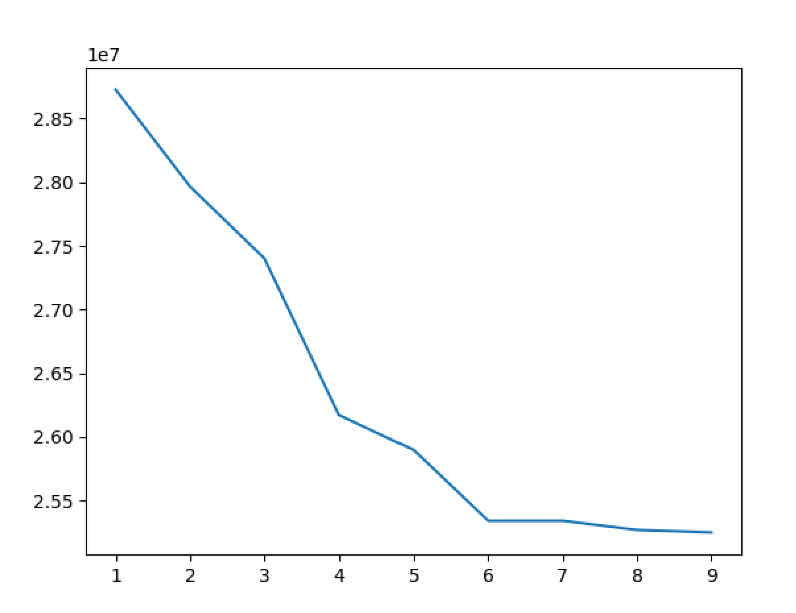

# Image Segmentation

Image Segmentation using Gaussian Mixture Models.

# Files

-   `main.py`: The main script that segments a particular image and saves the output.
-   `utils.py`: A utility script dedicated to finding the best value of `components`. See [this section](#optimal-components-value) for more details.
-   `images`: Some testing images.
-   `output.png`: Sample output.

# Usage

## Main

`python main.py [path] -c [components] -o [output]`

Required Arguments

-   `path`: Relative path to the image.

Optional Arguments

-   `components`: Number of components used in the mixture. Defaults to 6.
-   `output`: Name of the output file containing the segmented image. Defaults to "output".

## Utils

`python utils.py [path]`

Required Arguments

-   `path`: Relative path to the image

# Optimal `components` value

There is no universal `components` value; each image has a different, reasonable `components` value.

To find this value, run the utility script, and wait until the graph is displayed (this takes a couple of minutes).

The graph should look something like this.

To deduce the best value of `components`, look for the occurrence of any elbows. In the graph above, the elbows occur at `components` = 4 and at `components` = 6.
